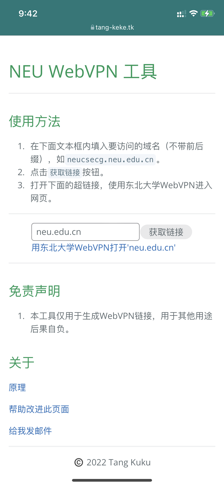

# 在校外通过WebVPN访问东北大学校园网任何网页的方法

## why
1. 学校给的SSL VPN服务很不稳定，而且需要安装客户端/浏览器插件。
2. 学校提供的WebVPN服务所能选择的网页很少，cg平台和oj等常用网页都没有提供。
## how
### 原理
1. 通过分析WebVPN的链接发现，都是以`https://webvpn.neu.edu.cn/http/77726476706e69737468656265737421`开头。
2. 这个链接后面的内容实际上是通过AES-128加密的域名，再加上url后半段。

## 在哪用？
### web端
[点我](tang-keke.tk/webvpn)


### 客户端
1. 安装pycrypto：`pip3 install pycrypto`
2. 将下面脚本中的`url`改为你想要访问的域名。
```python
from Crypto.Cipher import AES

url = 'neucsecg.neu.edu.cn'

cipher = AES.new(
    'wrdvpnisthebest!',
    AES.MODE_CFB,
    'wrdvpnisthebest!',
    segment_size=128)
cipher_text = cipher.encrypt(url.ljust(len(url)//16*16+16, '\0').encode())

res = 'https://webvpn.neu.edu.cn/http/77726476706e69737468656265737421' \
    + cipher_text[:len(url)].hex()
print(res)
```
3. 运行脚本，输出的链接即为转换后的链接

4. 用浏览器打开链接，enjoy

